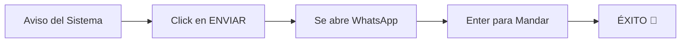

# 📚 Guía de Usuario: ClientPulse V2
### *Tu centro de mando para una relación perfecta con tus clientes.*

Bienvenido a **ClientPulse V2**. Esta guía ha sido diseñada para que cualquier persona, sin importar su conocimiento técnico, pueda dominar el sistema en 5 minutos. Olvida las APIs complicadas y los códigos; aquí todo es visual, intuitivo y directo.

---

## 🎯 1. ¿Qué es ClientPulse V2?

ClientPulse es una herramienta que te ayuda a **no olvidar nunca** a un cliente. Te permite organizar tu base de datos y programar mensajes de WhatsApp (con texto e imágenes) para que el sistema te avise exactamente cuándo enviarlos.

**Lo más importante:**
*   ✅ **Tus clientes NO necesitan registrarse en nada.**
*   ✅ **No necesitas pagar por APIs costosas.**
*   ✅ **Tú tienes el control total del envío desde tu propio WhatsApp.**

---

## 🚀 2. Primeros Pasos: Registro e Inicio

### Creando tu cuenta
1.  Ingresa a la página de [Registro](https://clientpulse-v2-marcos.vercel.app/register).
2.  Completa tu nombre, email y una contraseña segura.
3.  Haz click en **"Crear mi cuenta"**. ¡Ya eres parte de la élite comercial!

### El Asistente de Bienvenida (Onboarding)
Al entrar por primera vez, verás un asistente que te guiará:
*   **Paso 1: Tu Perfil.** Sube tu foto y nombre para que el sistema se sienta tuyo.
*   **Paso 2: Configuración de WhatsApp.** Aquí seleccionas cómo quieres que el sistema te avise. (Recomendamos el método de **"Enlace Directo"** por ser el más sencillo).
*   **Paso 3: Tu primera Categoría.** Crea grupos como "VIP", "Nuevos" o "Seguimiento".

---

## 📊 3. Explorando tu Tablero (Dashboard)

El tablero es tu "torre de control". Aquí verás:
*   **Saludo Dinámico:** Te indica cuántos mensajes tienes pendientes hoy.
*   **Métricas Rápidas:** Cuántos clientes tienes y qué porcentaje de éxito llevas.
*   **Tips del Coach:** Consejos inteligentes para mejorar tus ventas basándose en datos reales.
*   **Actividad Reciente:** Un historial de tus últimos movimientos.

---

## 👥 4. Gestión de Clientes

### Añadir un Cliente
1.  Ve a la sección **"Clientes"** en el menú lateral.
2.  Haz click en el botón **"+"** o **"Añadir Cliente"**.
3.  Ingresa los datos básicos:
    *   **Nombre:** Como lo tienes guardado.
    *   **WhatsApp:** Con el código de país (Ej: +593...).
    *   **Categoría:** Así sabrás de qué tipo de cliente se trata.

> [!TIP]
> Mantén tus fotos de perfil actualizadas en la ficha del cliente para reconocerlos visualmente más rápido.

---

## ⏰ 5. Cómo Programar un Recordatorio

Esta es la función estrella de ClientPulse. Sigue estos pasos:

1.  Busca a tu cliente en la lista y entra en su **Ficha de Detalle**.
2.  Haz click en **"Nuevo Recordatorio"**.
3.  Configura el contenido:
    *   📅 **Fecha y Hora:** Cuándo quieres enviar el mensaje.
    *   ✍️ **Mensaje:** Escribe lo que quieras enviarle. Puedes usar el nombre del cliente para que sea personal.
    *   🖼️ **Imagen (Opcional):** Sube una foto promocional, un comprobante o un saludo visual.
4.  Haz click en **"Programar"**.

---

## 📱 6. El Proceso de Envío (¡Súper Fácil!)

Cuando llegue la hora programada, el sistema te avisará. El flujo de trabajo es el siguiente:

### Paso a paso del envío:
1.  En tu panel verás el aviso: **"Tienes 1 mensaje pendiente para [Cliente]"**.
2.  Haz click en el botón azul **"ENVIAR"**. Esto abrirá una pestaña nueva con el chat de ese cliente listo.
3.  Si el mensaje incluía una imagen, el aplicativo te mostrará un botón de **"Copiar Imagen"**. Haz click.
4.  Ve a la ventana de WhatsApp, presiona `Ctrl + V` (Pegar) y presiona **Enter**.

**¿Por qué lo hacemos así?** 
Porque así usamos **tu propia conexión de WhatsApp**, asegurando que el mensaje llegue como si lo hubieras escrito tú mismo, sin riesgos de bloqueos y totalmente gratis.

---

## 📂 7. Categorías y Organización

Puedes crear tantas categorías como necesites (Ej: *Prospectos, Demo, Pago Pendiente, VIP*).
*   Asigna colores a cada una para identificarlas visualmente en el calendario.
*   Filtra tus clientes por categoría para hacer campañas específicas.

---

## ❓ 8. Preguntas Frecuentes (FAQ)

**¿Tengo que dejar la página abierta para que se envíen los mensajes?**
No. El sistema guarda tus programaciones en la nube (Firebase). Puedes cerrar sesión o apagar tu computadora; los avisos se generarán igual. Solo necesitas entrar para hacer el click final de envío.

**¿Puedo enviar videos?**
Sí. De la misma forma que con las imágenes, puedes subir archivos y luego pegarlos en el chat.

**¿Es seguro para mis datos?**
Absolutamente. Usamos la tecnología de **Google Firebase**, lo que garantiza que tu información está encriptada y solo tú tienes acceso a ella con tus credenciales.

---

### *¿Necesitas más ayuda?*
*Si tienes dudas adicionales, puedes contactar al soporte técnico haciendo click en el icono de ayuda en la esquina inferior izquierda del aplicativo.*

---
**¡Felicidades!** Ahora eres un experto en **ClientPulse V2**. Empieza hoy mismo a crecer el "pulso" de tu negocio.
